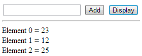

# js-assignments

1. Write a JavaScript function to check whether an `input` is an array or not.

2. Write a JavaScript function to clone an array.

3. Write a JavaScript function to get the first element of an array. Passing the parameter 'n' will return the first 'n' elements of the array.

4. Write a JavaScript function to get the last element of an array. Passing the parameter 'n' will return the last 'n' elements of the array.

5. Write a simple JavaScript program to join all elements of the following array into a string.
   Sample array : myColor = ["Red", "Green", "White", "Black"];
   Expected Output :
   "Red,Green,White,Black"
   "Red,Green,White,Black"
   "Red+Green+White+Black"

6. Write a JavaScript program that accepts a number as input and inserts dashes (-) between each even number. For example if you accept 025468 the output should be 0-254-6-8.

7. Write a JavaScript program to sort the items of an array.
   Sample array : var arr1 = [ -3, 8, 7, 6, 5, -4, 3, 2, 1 ];
   Sample Output : -4,-3,1,2,3,5,6,7,8

8. Write a JavaScript program to find the most frequent item in an array.
   Sample array : var arr1=[3, 'a', 'a', 'a', 2, 3, 'a', 3, 'a', 2, 4, 9, 3];
   Sample Output : a ( 5 times )

9. Write a JavaScript program that accepts a string as input and swaps the case of each character. For example if you input 'The Quick Brown Fox' the output should be 'tHE qUICK bROWN fOX'.

10. Write a JavaScript program that prints the elements of the following array.
    Note : Use nested for loops.
    Sample array : var a = [[1, 2, 1, 24], [8, 11, 9, 4], [7, 0, 7, 27], [7, 4, 28, 14], [3, 10, 26, 7]];
    Sample Output :
    "row 0"
    " 1"
    " 2"
    " 1"
    " 24"
    "row 1"

11. Write a JavaScript program to find the sum of squares of a numerical vector.

12. Write a JavaScript program to compute the sum and product of an array of integers.

13. Write a JavaScript program to add items to a blank array and display them.
    Sample Screen :
    
    add elements in an blank array

14. Write a JavaScript program to remove duplicate items from an array (ignore case sensitivity).

15. We have the following arrays :
    color = ["Blue ", "Green", "Red", "Orange", "Violet", "Indigo", "Yellow "];
    o = ["th","st","nd","rd"]
    Write a JavaScript program to display the colors in the following way :
    "1st choice is Blue ."
    "2nd choice is Green."
    "3rd choice is Red."

---

Note : Use ordinal numbers to tell their position.

16. Write a JavaScript program to find the leap years in a given range of years.

17. Write a JavaScript program to shuffle an array.

18. Write a JavaScript program to perform a binary search.
    Note : A binary search or half-interval search algorithm finds the position of a specified input value within an array sorted by key value.
    Sample array :
    var items = [1, 2, 3, 4, 5, 7, 8, 9];
    Expected Output :
    console.log(binary_Search(items, 1)); //0
    console.log(binary_Search(items, 5)); //4

19. There are two arrays with individual values. Write a JavaScript program to compute the sum of each individual index value in the given array.
    Sample array :
    array1 = [1,0,2,3,4];
    array2 = [3,5,6,7,8,13];
    Expected Output :
    [4, 5, 8, 10, 12, 13]

20. Write a JavaScript program to find duplicate values in a JavaScript array.

21. Write a JavaScript program to flatten a nested (any depth) array. If you pass shallow, the array will only be flattened to a single level.
    Sample Data :
    console.log(flatten([1, [2], [3, [[4]]],[5,6]]));
    [1, 2, 3, 4, 5, 6]
    console.log(flatten([1, [2], [3, [[4]]],[5,6]], true));
    [1, 2, 3, [[4]], 5, 6]

22. Write a JavaScript program to compute the union of two arrays.
    Sample Data :
    console.log(union([1, 2, 3], [100, 2, 1, 10]));
    [1, 2, 3, 10, 100]

23. Write a JavaScript function to find the difference between two arrays.
    Test Data :
    console.log(difference([1, 2, 3], [100, 2, 1, 10]));
    ["3", "10", "100"]
    console.log(difference([1, 2, 3, 4, 5], [1, [2], [3, [[4]]],[5,6]]));
    ["6"]
    console.log(difference([1, 2, 3], [100, 2, 1, 10]));
    ["3", "10", "100"]

24. Write a JavaScript function to remove. 'null', '0', '""', 'false', 'undefined' and 'NaN' values from an array.
    Sample array : [NaN, 0, 15, false, -22, '',undefined, 47, null]
    Expected result : [15, -22, 47]

25. Write a JavaScript function to sort the following array of objects by title value.
    Sample object :

var library = [
{ author: 'Bill Gates', title: 'The Road Ahead', libraryID: 1254},
{ author: 'Steve Jobs', title: 'Walter Isaacson', libraryID: 4264},
{ author: 'Suzanne Collins', title: 'Mockingjay: The Final Book of The Hunger Games', libraryID: 3245}
];

Expected result :
[[object Object] {
author: "Suzanne Collins",
libraryID: 3245,
title:"Mockingjay:The Final Book of The Hunger Games"
}, [object Object] {
author: "Bill Gates",
libraryID: 1254,
title: "The Road Ahead"
}, [object Object] {
author: "Steve Jobs",
libraryID: 4264,
title: "Walter Isaacson"
}]

26. Write a JavaScript program to find a pair of elements (indices of the two numbers) in a given array whose sum equals a specific target number.

Input: numbers= [10,20,10,40,50,60,70], target=50
Output: 2, 3

27. Write a JavaScript function to retrieve the value of a given property from all elements in an array.
    Sample array : [NaN, 0, 15, false, -22, '',undefined, 47, null]
    Expected result : [15, -22, 47]

28. Write a JavaScript function to find the longest common starting substring in a set of strings.

Sample array : console.log(longest_common_starting_substring(['go', 'google']));
Expected result : "go"

29. Write a JavaScript function to fill an array with values (numeric, string with one character) within supplied bounds.

Test Data :
console.log(num_string_range('a', "z", 2));
["a", "c", "e", "g", "i", "k", "m", "o", "q", "s", "u", "w", "y"]

30. Write a JavaScript function that merges two arrays and removes all duplicate elements.

Test data :
var array1 = [1, 2, 3];
var array2 = [2, 30, 1];
console.log(merge_array(array1, array2));
[3, 2, 30, 1]

31. Write a JavaScript function to remove a specific element from an array.

Test data :
console.log(remove_array_element([2, 5, 9, 6], 5));
[2, 9, 6]

32. Write a JavaScript function to find an array containing a specific element.

Test data :
arr = [2, 5, 9, 6];
console.log(contains(arr, 5));
[True]

33. Write a JavaScript script to empty an array while keeping the original.

34. Write a JavaScript function to get the nth largest element from an unsorted array.

Test Data :
console.log(nthlargest([ 43, 56, 23, 89, 88, 90, 99, 652], 4));
89

35. Write a JavaScript function to get random items from an array.

36. Write a JavaScript function to create a specified number of elements with a pre-filled numeric value array.

Test Data :
console.log(array_filled(6, 0));
[0, 0, 0, 0, 0, 0]
console.log(array_filled(4, 11));
[11, 11, 11, 11]

37. Write a JavaScript function to create a specified number of elements with a pre-filled string value array.

Test Data :
console.log(array_filled(3, 'default value'));
["default value", "default value", "default value"]
console.log(array_filled(4, 'password'));
["password", "password", "password", "password"]

39. Write a JavaScript function to filter false, null, 0 and blank values from an array.

Test Data :
console.log(filter_array_values([58, '', 'abcd', true, null, false, 0]));
[58, "abcd", true]

40. Write a JavaScript function to generate an array of integer numbers, increasing one from the starting position, of a specified length.

Test Data :
console.log(array_range(1, 4));
[1, 2, 3, 4]
console.log(array_range(-6, 4));
[-6, -5, -4, -3]

41. Write a JavaScript function to generate an array between two integers of 1 step length.

Test Data :
console.log(rangeBetwee(4, 7));
[4, 5, 6, 7]
console.log(rangeBetwee(-4, 7));
[-4, -3, -2, -1, 0, 1, 2, 3, 4, 5, 6, 7]

42. Write a JavaScript function to find unique elements in two arrays.

Test Data :
console.log(difference([1, 2, 3], [100, 2, 1, 10]));
["1", "2", "3", "10", "100"]
console.log(difference([1, 2, 3, 4, 5], [1, [2], [3, [[4]]],[5,6]]));
["1", "2", "3", "4", "5", "6"]
console.log(difference([1, 2, 3], [100, 2, 1, 10]));
["1", "2", "3", "10", "100"]

43. Write a JavaScript function to create an array of arrays, ungrouping the elements in an array produced by zip.

Test Data :
unzip([['a', 1, true], ['b', 2, false]])
unzip([['a', 1, true], ['b', 2]])
Expected Output:
[["a","b"],[1,2],[true,false]]
[["a","b"],[1,2],[true]]

44. Write a JavaScript function to create an object from an array, using the specified key and excluding it from each value.

Test Data :
indexOn([ { id: 10, name: 'apple' }, { id: 20, name: 'orange' } ], x => x.id)
Expected Output:
{"undefined":{"id":20,"name":"orange"}}

45. Write a JavaScript program to find all the unique values in a set of numbers.

Test Data :
[1, 2, 2, 3, 4, 4, 5]
[1, 2, 3, 4, 5]
[1, -2, -2, 3, 4, -5, -6, -5]
Expected Output:
[1,2,3,4,5]
[1,2,3,4,5]
[1,-2,3,4,-5,-6]

46. Write a JavaScript program to generate all permutations of an array's elements (including duplicates).

Test Data :
[1, 33, 5]
[1, 3, 5, 7]
[2, 4]
Expected Output:
[[1,33,5],[1,5,33],[33,1,5],[33,5,1],[5,1,33],[5,33,1]]
[[1,3,5,7],[1,3,7,5],[1,5,3,7],[1,5,7,3],[1,7,3,5],[1,7,5,3],[3,1,5,7],[3,1,7,5],[3,5,1,7],[3,5,7,1],[3,7,1,5],[3,7,5,1],[5,1,3,7],[5,1,7,3],[5,3,1,7],[5,3,7,1],[5,7,1,3],[5,7,3,1],[7,1,3,5],[7,1,5,3],[7,3,1,5],[7,3,5,1],[7,5,1,3],[7,5,3,1]]
[[2,4],[4,2]]

47. Write a JavaScript program to remove all false values from an object or array.

Test Data :
const obj = {
a: null,
b: false,
c: true,
d: 0,
e: 1,
f: '',
g: 'a',
h: [null, false, '', true, 1, 'a'],
i: { j: 0, k: false, l: 'a' }
Expected Output:
{"c":true,"e":1,"g":"a","h":[true,1,"a"],"i":{"l":"a"}}

48. Write a JavaScript program that takes an array of integers and returns false if every number is not prime. Otherwise, return true.

Test Data :
([2,3,5,7]) -> true
([2,3,5,7,8]) -> false
Expected Output:
Original array of integers: 2,3,5,7
In the said array check every numbers are prime or not! true
Original array of integers: 2,3,5,7,8
In the said array check every numbers are prime or not! false

49. Write a JavaScript program that takes an array of numbers and returns the third smallest number.

Test Data :
(2,3,5,7,1) -> 3
(2,3,0,5,7,8,-2,-4) -> 0
Expected Output:
Original array of numbers: 2,3,5,7,1
Third smallest number of the said array of numbers: 3
Original array of numbers: 2,3,0,5,7,8,-2,-4
Third smallest number of the said array of numbers: 0

50. Write a JavaScript program that takes an array with mixed data type and calculates the sum of all numbers.

Test Data :
([2, "11", 3, "a2", false, 5, 7, 1]) -> 18
([2, 3, 0, 5, 7, 8, true, false]) -> 25
Expected Output:
Original array: 2,11,3,a2,false,5,7,1
Sum all numbers of the said array: 18
Original array: 2,3,0,5,7,8,true,false
Sum all numbers of the said array: 25

51. Write a JavaScript program to check if an array is a factor chain or not.

A factor chain is an array in which the previous element is a factor of the next consecutive element. The following is a factor chain:
[2, 4, 8, 16, 32]
// 2 is a factor of 4
// 4 is a factor of 8
// 8 is a factor of 16
// 16 is a factor of 32

Test Data :
([2, 4, 8, 16, 32]) -> true
([2, 4, 16, 32, 64]) -> true
([2, 4, 16, 32, 68]) -> false
Expected Output:
Original array:
Check the said array is a factor chain or not?
true
Original array:
Check the said array is a factor chain or not?
true
Original array:
Check the said array is a factor chain or not?
false

52. Write a JavaScript program to get all the indexes where NaN is found in a given array of numbers and NaN.

Test Data :
([2, NaN, 8, 16, 32]) -> [1]
([2, 4, NaN, 16, 32, NaN]) -> [2,5]
([2, 4, 16, 32]) ->[]
Expected Output:
Original array: 2,NaN,8,16,32
Find all indexes of NaN of the said array: 1
Original array: 2,4,NaN,16,32,NaN
Find all indexes of NaN of the said array: 2,5
Original array: 2,4,16,32
Find all indexes of NaN of the said array:

53. Write a JavaScript program to count the number of arrays inside a given array.

Test Data :
([2,8,[6],3,3,5,3,4,[5,4]]) -> 2
([2,8,[6,3,3],[4],5,[3,4,[5,4]]]) -> 3
Expected Output:
Number of arrays inside the said array: 2
Number of arrays inside the said array: 3

54.Define a function called cleanNames that accepts an array of strings containing additional space characters at the beginning and end. The cleanNames() function should use the array map method to return a new array full of trimmed names.

55. Write a function that converts an array of values from miles to kilometres using the map method. In the end, add the kilometres up in a new variable called "totalDistanceInKilometers" and return this variable.

56. Square and sum the array elements using the arrow function and then find the average of the array.

57. Create a new array using the map function whose each element is equal to the original element plus 4.

58. From the array of numbers, choose even double even numbers and compute the sum using Array's filter, map and reduce methods.

59. Create a new array whose elements is in uppercase of words present in the original array.

60. Use the .map() method on the heros array to return a new array.

The new array should rename the 'name' key to 'hero'.
The 'name' key should not appear in the new array.
The new array should have a new key added called (id).

The key 'id' should be based on the index.

const heros = [
{ name: 'Spider-Man' },
{ name: 'Thor' },
{ name: 'Black Panther' },
{ name: 'Captain Marvel' },
{ name: 'Silver Surfer' }
];
EXPECTED OUTPUT (array of objects):
[
{ id: 0, hero: 'Spider-Man' },
{ id: 1, hero: 'Thor' },
{ id: 2, hero: 'Black Panther' },
{ id: 3, hero: 'Captain Marvel' },
{ id: 4, hero: 'Silver Surfer' }
]

61. Consider the following array:

    const inputWords = ["spray", "limit", "elite", "exuberant", "destruction", "present"];

    Write JavaScript statements that will produce the following output:
    ["exuberant", destruction", "present"]

62. Starting with an array containing the numbers 1 through 10, use filter, map, and reduce to produce the following. Use console.log to display the results.

-- An array of odd numbers.
-- An array of numbers divisible by 2 or 5.
-- An array of numbers divisible by 3 and then squared those numbers.
-- The sum of the following: square the numbers divisible by 5.

63. Consider the following array:
    let nums = [11, 22, 33, 46, 75, 86, 97, 98];
    Use filter then map functions to filter even numbers then square them. Assign the result to a variable named squaredEvenNums and display it. The output should be:

    squaredEvenNums: [484, 2116, 7396, 9604]

    Use the reduce function to calculate the sum of nums array. The output should be:

    Sum of array elements: 468

64. Write a function Myfunc that takes in an array of numbers and multiply each of the elements by 2.

Sample Input
Myfunc([1, 2 ,3]);
Sample Output
[2, 4, 6]
